# How to pass Azure Data Fundamentals DP-900

## Pre Exam

1. Access this link https://docs.microsoft.com/en-us/learn/certifications/azure-fundamentals/ to study and register the exam

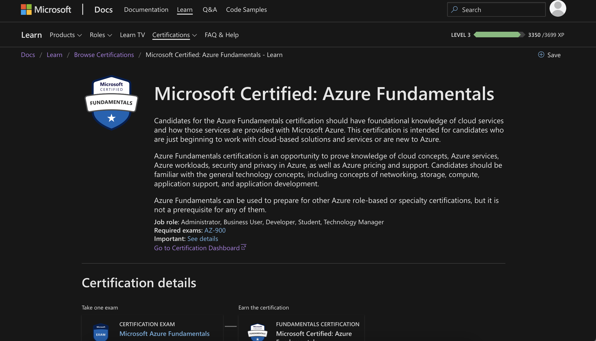

2. For register the exam, I have an online contest, so I choice "Schedule with Pearson VUE". The contest will take place online. Link: https://examregistration.microsoft.com/?whr=uri:MicrosoftAccount&locale=en-us&examcode=AZ-900&examname=Exam%20AZ-900:%20Microsoft%20Azure%20Fundamentals&returnToLearningUrl=https%3A%2F%2Fdocs.microsoft.com%2Flearn%2Fcertifications%2Fexams%2Faz-900&silentauth=msa&lng=vi&channel=EDP#userlegalprofile. 

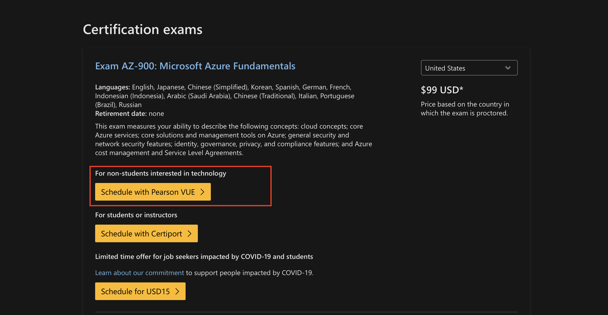

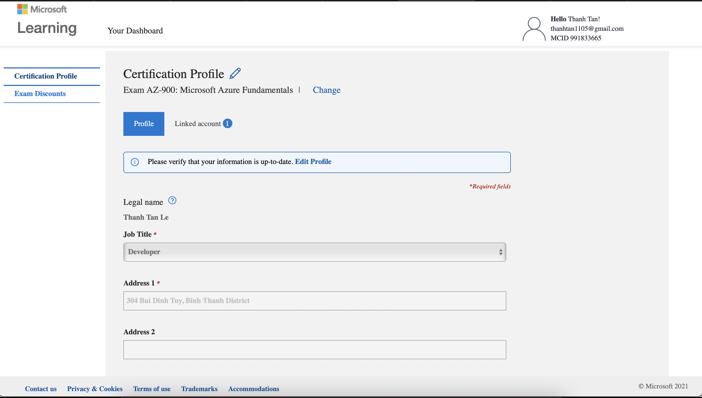

3. Input the information and schedule for the exam

4. Schedule the exam and check the email

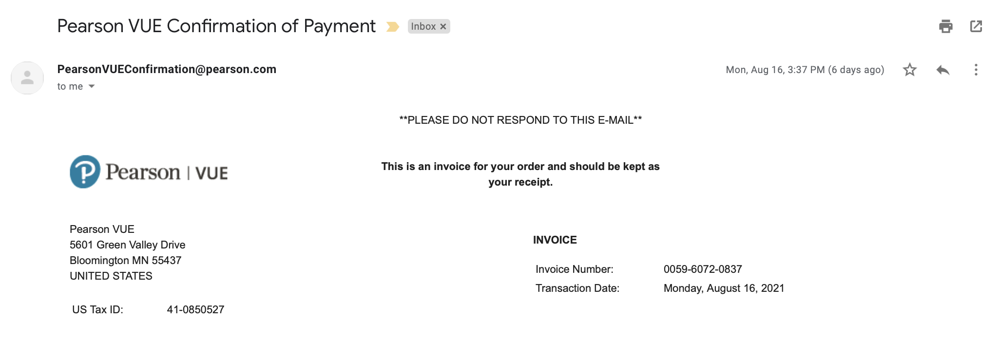

5. If you can not prepare well for the exam, you can reschedule the exam before 24 hours

## Learning

1. If you want to prepare better for the exam. I recommend should be take one or more course in the udemy. I take 2 course and pass rate will be increase.

    1.1 https://www.udemy.com/course/dp900-azure/

    2.2 https://www.udemy.com/course/dp-900-azure-data-fundamentals-5-practice-tests/

2. Get back to my github, I already had prepare the book, basic knowledge must to be know in one day. You can small start from here.

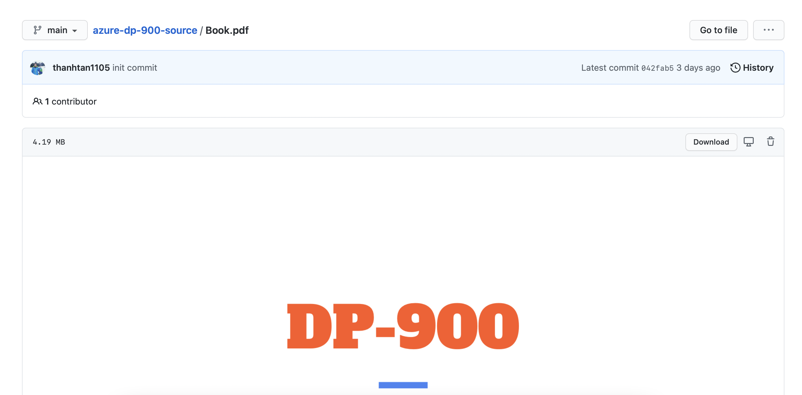

3. Next step, I already had prepare the notebook, standard knowledge and tips must memorize to prepare well for the exam. According to experience, you should memorize first and then start taking the test.

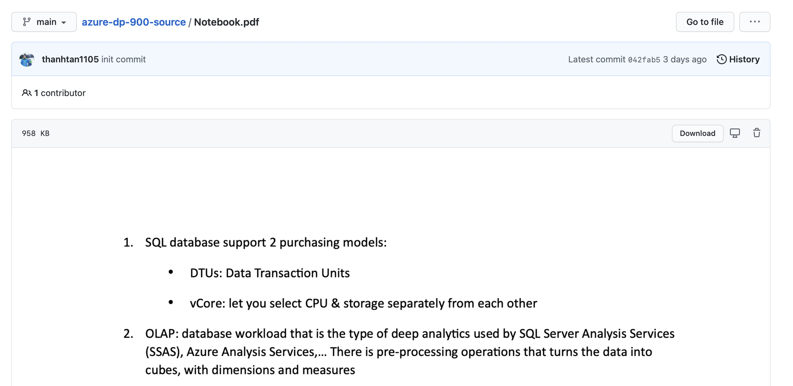

## Doing Exam

I choice the online test method "For Pearson VUE Exam". Some points you need to focus

1. Check schedule exam on the email

    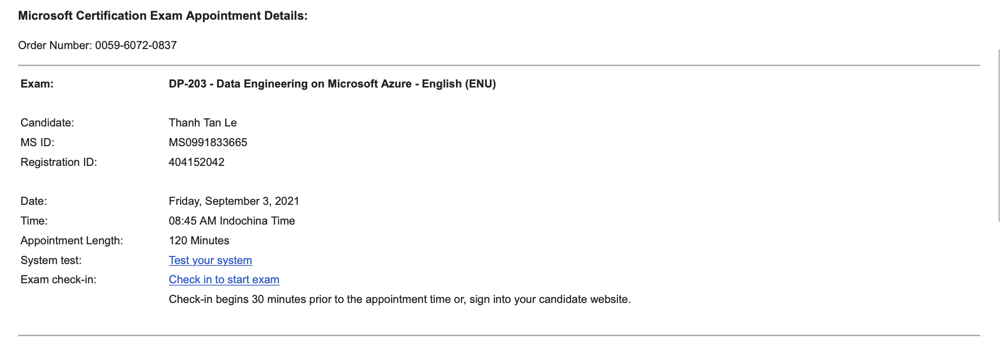

2. Follow "Admission Policy" on the email from PearsonVUEConfirmation@pearson.com. "Before exam day", "Prepare your testing space", "On exam day"

    

    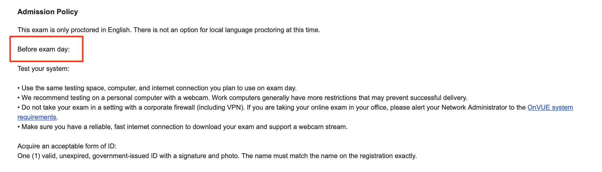

    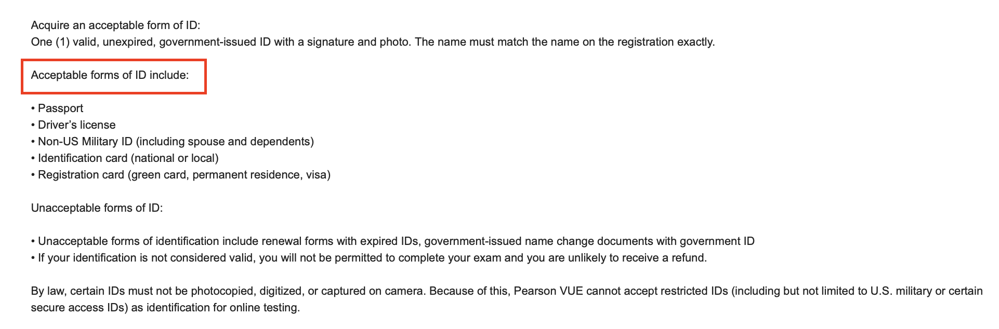

    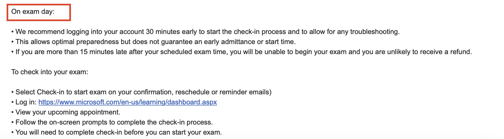

    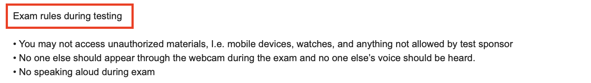

3. For my experience, you should clean your desk, remove monitor and anything can be distracting. Should be use laptop have camera.

4. The result and certificate will send to you after finish the exam, right away.

## Conclusion

Azure Fundamentals certification is an opportunity to prove knowledge of cloud concepts, Azure services, Azure workloads, security and privacy in Azure, as well as Azure pricing and support. Candidates should be familiar with the general technology concepts, including concepts of networking, storage, compute, application support, and application development.

Azure Fundamentals can be used to prepare for other Azure role-based or specialty certifications, but it is not a prerequisite for any of them.

Good luck to you. Feel free to be share

